# CloudLaunch – AWS Deployment (Semester 3 – Month 1 Assessment)

## Overview
For this assignment, I built **CloudLaunch**, a lightweight platform that hosts a static company website and manages private internal documents.  
The goal was to demonstrate my understanding of AWS core services including **S3**, **IAM**, and **VPC**.  

---

## Task 1: Static Website Hosting with S3 + IAM

### Step 1: Creating the Buckets
I created three S3 buckets to separate the use cases:
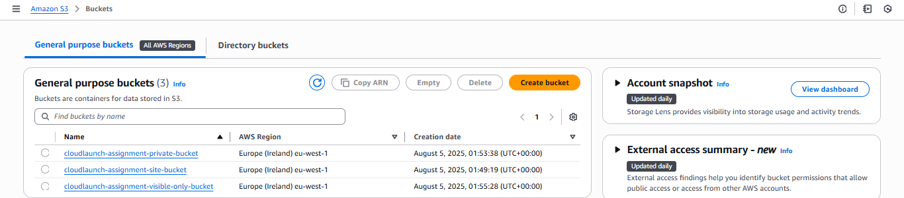

1. **cloudlaunch-assignment-site-bucket**  
   - This bucket hosts the static website.  
   - I enabled static website hosting and set it to be **publicly accessible** with a bucket policy that allows anonymous users to `GetObject`.  
   - I uploaded an `index.html`, `style.css`, and `script.js` file to give the site a clean, professional look.

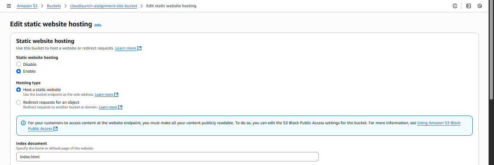  
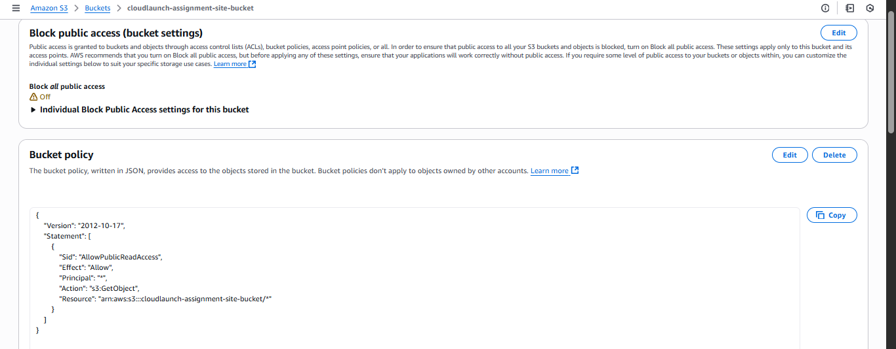
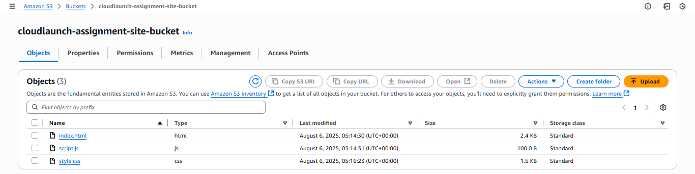

2. **cloudlaunch-assignment-private-bucket**  
   - This bucket is for private internal storage.  
   - I kept Block Public Access enabled so it’s not publicly accessible.  
   - I later gave my IAM user limited permissions (`GetObject` and `PutObject` only).  

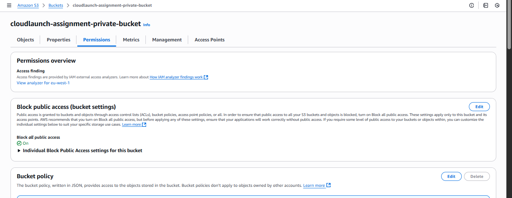

3. **cloudlaunch-assignment-visible-only-bucket**  
   - This bucket is designed so the IAM user can see it exists (via `ListBucket`) but cannot access any objects inside.  
   - It is fully private.  

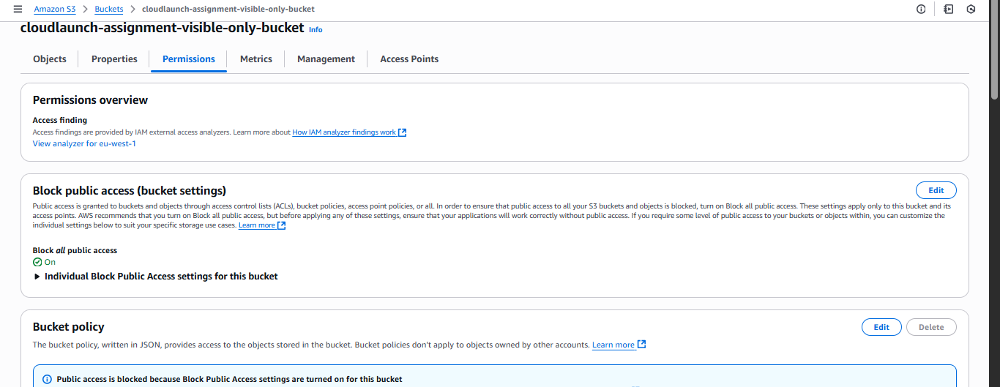

---

### Step 2: Configuring IAM User
I created an IAM user named **cloudlaunch-user** with the following rules:
- They can `ListBucket` for all three buckets.  
- They can `GetObject` on the **site bucket**.  
- They can `GetObject` and `PutObject` on the **private bucket**.  
- They cannot delete objects anywhere.  
- They cannot access contents of the **visible-only bucket**.  

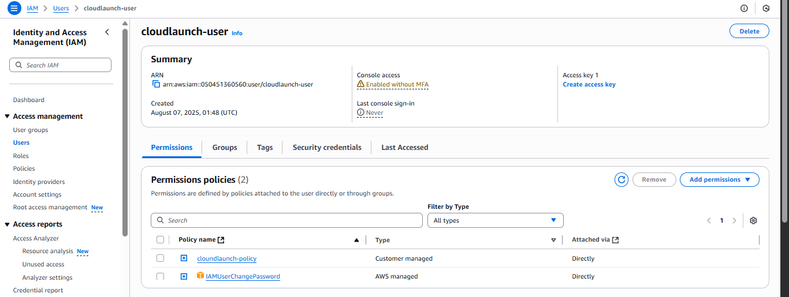

I attached a custom JSON policy (see [Custom Policy JSON](policies/cloudlaunch-user-policy.json) in the repo) that defines these rules.  
I enforced password reset on first login for security.

---

### Step 3: Verifying the Static Website
After setting up the bucket policy and uploading my files, I confirmed the site was live.  
You can view it here:  
[Static Website Link](http://cloudlaunch-assignment-site-bucket.s3-website-eu-west-1.amazonaws.com)

The website includes:
- A responsive layout built with HTML, CSS, and JavaScript.  
- Sections for **About**, **Core Features**, and **Documentation**.  
- A simple interactive button to demonstrate JavaScript functionality.  

---

### Bonus: CloudFront Setup
I attempted to set up a **CloudFront distribution** to provide HTTPS and global caching.  

- I went through the CloudFront distribution wizard, selected my S3 website endpoint as the origin, and filled in the configuration.  
- However, I was unable to complete the setup because my AWS account is not yet verified for CloudFront.  
- I submitted a request for verification and included a screenshot of the error prompt in the repository for reference.  

If my account gets verified, I’ll finish this step to enable HTTPS.  

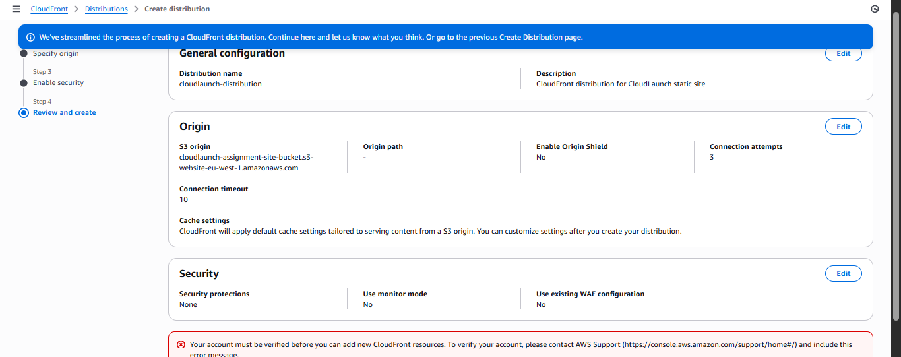

---

## 🌐 Task 2: VPC Design

### Step 1: Creating the VPC
I created a VPC named **cloudlaunch-vpc** with the CIDR block `10.0.0.0/16`.  
I chose **VPC only** during setup to manually configure the components.

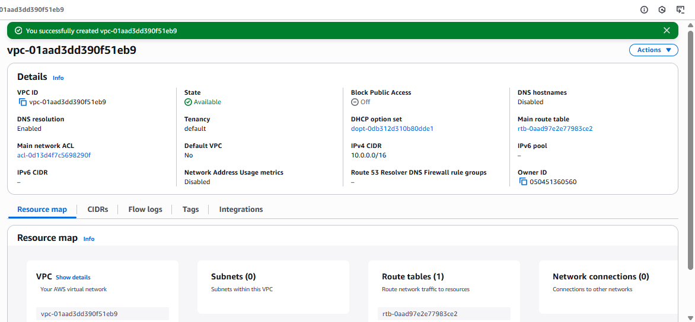

---

### Step 2: Creating Subnets
Within the VPC, I created three subnets:
- **Public Subnet** (`10.0.1.0/24`)  
  - For future public-facing services or load balancers.  
  - Auto-assign public IP enabled.  
- **Application Subnet** (`10.0.2.0/24`)  
  - For application servers.  
  - Kept private with no public IP assignment.  
- **Database Subnet** (`10.0.3.0/28`)  
  - For database services like RDS.  
  - Fully private with no public IP assignment.  

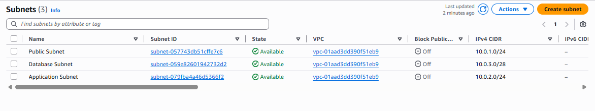

---

### Step 3: Internet Gateway
I created an Internet Gateway named **cloudlaunch-igw** and attached it to the VPC.

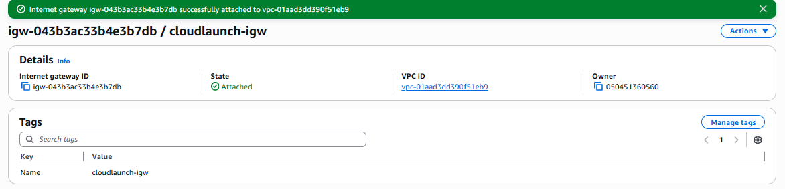

---

### Step 4: Configuring Route Tables
I created and associated three route tables:
- **cloudlaunch-public-rt**  
  - Associated with the Public Subnet.  
  - Routes:  
    - `10.0.0.0/16 → local`  
    - `0.0.0.0/0 → cloudlaunch-igw`  

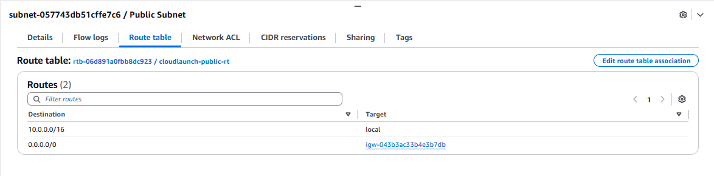

- **cloudlaunch-app-rt**  
  - Associated with the Application Subnet.  
  - Route: `10.0.0.0/16 → local` (no internet route, keeping it private).

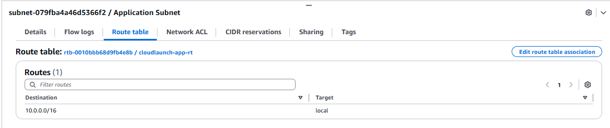

- **cloudlaunch-db-rt**  
  - Associated with the Database Subnet.  
  - Route: `10.0.0.0/16 → local` (fully private). 

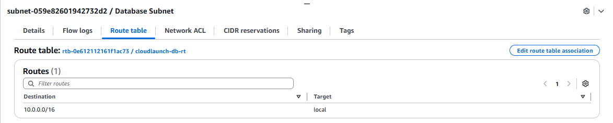 

---

### Step 5: Setting Up Security Groups
I created two security groups:
- **cloudlaunch-app-sg**
  - Allows HTTP (port 80) traffic within the VPC CIDR (`10.0.0.0/16`).  

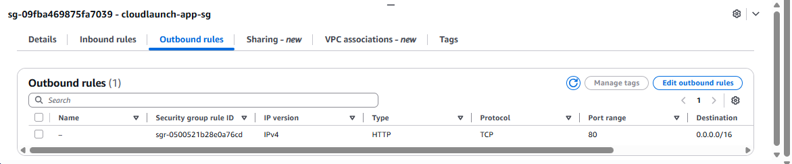

- **cloudlaunch-db-sg**
  - Allows MySQL (port 3306) traffic only from the Application Subnet (`10.0.2.0/24`).  

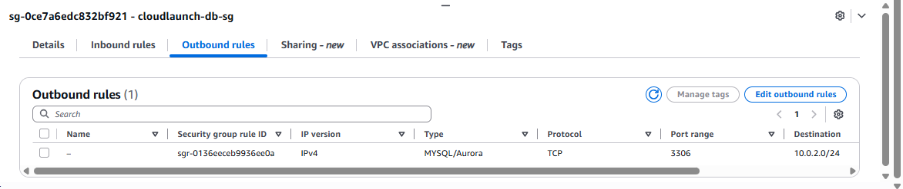

---

### Step 6: IAM Permissions for VPC
I updated the IAM policy for **cloudlaunch-user** to include read-only permissions for the VPC and its components.  
This allowed the user to use the AWS Console to view:
- VPCs  
- Subnets  
- Route Tables  
- Internet Gateways  
- Security Groups  

The user cannot create, modify, or delete any VPC resources.  

(see [Custom Policy JSON](policies/cloudlaunch-user-policy.json) in the repo)

---

### Network Diagram

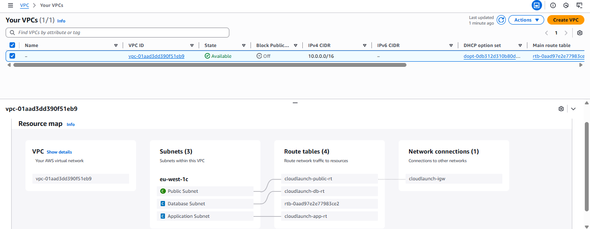

---

